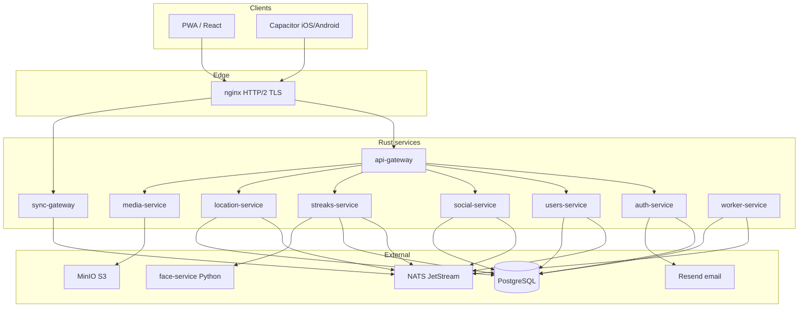

# 01 — Архитектура: Rust-микросервисы StreakMeet

> **Зафиксированные решения (2026-05-30)**
>
> - Клиентский realtime: **gRPC streaming** (Connect-RPC / HTTP/2)
> - HTTP: **гибрид** — idempotent команды через REST/Connect unary, состояние через event stream
> - Деплой: **1 разработчик, один VPS**
> - Face ML: **Python-микросервис без изменений**

---

## 1. Цели перепроектирования

| Было (Node monolith)         | Станет                                              |
| ---------------------------- | --------------------------------------------------- |
| Express REST + Socket.IO     | Connect/gRPC unary + **server-stream Sync**         |
| Один процесс PM2             | Несколько контейнеров на одном VPS (docker-compose) |
| `notification` → SWR refetch | Типизированные **sync-события** с payload           |
| In-memory `userSockets` Map  | Event bus + streaming gateway с reconnect/catch-up  |
| Prisma                       | SQLx (общая PostgreSQL)                             |

**Продуктовая цель:** если A отправил заявку в друзья / создал серию / принял заявку / выключил трансляцию — у B UI обновляется **сразу**, без polling и без «toast + refetch».

---

## 2. Принцип для solo + VPS: «логические микросервисы»

На одном сервере нет смысла поднимать 12 процессов «как в Netflix». Стратегия:

```
┌─────────────────────────────────────────────────────────────┐
│  TARGET (логическая декомпозиция)                            │
│  — отдельные crate + отдельный Dockerfile на сервис        │
│  — общение только через gRPC / NATS, не shared memory       │
└─────────────────────────────────────────────────────────────┘
                              │
                              ▼
┌─────────────────────────────────────────────────────────────┐
│  DEPLOY на 1 VPS (docker-compose)                           │
│  — все сервисы на localhost / internal network              │
│  — nginx: TLS, HTTP/2, прокси к gateway                     │
│  — при росте: вынести media/worker на второй VPS без         │
│    переписывания контрактов                                 │
└─────────────────────────────────────────────────────────────┘
```

**Правило:** код и контракты — как у микросервисов; инфра на старте — один compose-файл.

---

## 3. Карта микросервисов



### 3.1 Сервисы — ответственность

| Сервис               | Порт (internal) | БД / storage      | Описание                                                                                           |
| -------------------- | --------------- | ----------------- | -------------------------------------------------------------------------------------------------- |
| **api-gateway**      | 8080            | —                 | Единая точка входа REST/Connect unary; JWT validation; rate limit; маршрутизация к downstream gRPC |
| **sync-gateway**     | 8081            | Redis/NATS        | **Server-stream** подписка клиента; reconnect, ack, catch-up cursor                                |
| **auth-service**     | 50051           | PostgreSQL        | register/login, OAuth Google/Apple, email verify, reset password, issue JWT                        |
| **users-service**    | 50052           | PostgreSQL        | profile, avatar meta, preferences, search, soft delete, public profile                             |
| **social-service**   | 50053           | PostgreSQL        | friendships: request, accept, reject, cancel, unfriend                                             |
| **streaks-service**  | 50054           | PostgreSQL        | streaks CRUD, meet, magic meet orchestration, remote selfie, remind                                |
| **location-service** | 50055           | PostgreSQL        | sharing toggle, coordinate updates                                                                 |
| **media-service**    | 50056           | S3                | AVIF encode, photo hash, combine remote selfie, presigned URLs                                     |
| **worker-service**   | —               | PostgreSQL + NATS | cron: streak burn, purge accounts, expire remote selfie, reconcile TZ                              |
| **face-service**     | 8001            | —                 | Python InsightFace (существующий)                                                                  |

### 3.2 Что объединить на фазе 1 (solo VPS)

Чтобы не утонуть в DevOps, **физически** можно стартовать с 4 контейнеров:

| Контейнер            | Внутри (Rust binaries или один binary с subcommands) |
| -------------------- | ---------------------------------------------------- |
| `streakmeet-gateway` | api-gateway + sync-gateway                           |
| `streakmeet-core`    | auth + users + social + streaks + location           |
| `streakmeet-media`   | media-service                                        |
| `streakmeet-worker`  | worker-service                                       |

Код при этом остаётся в **отдельных crate** workspace — split на процессы без переписывания.

---

## 4. Rust workspace (monorepo)

```
streakmeet/
  rework-backend/          # эта документация
  proto/                   # Buf: .proto контракты всех сервисов
  crates/
    streakmeet-types/      # общие типы, error codes
    streakmeet-db/         # SQLx queries, migrations
    streakmeet-auth/       # lib для auth-service
    streakmeet-users/
    streakmeet-social/
    streakmeet-streaks/
    streakmeet-location/
    streakmeet-media/
    streakmeet-sync/
    streakmeet-worker/
  services/
    api-gateway/           # binary
    sync-gateway/
    auth-service/
    ...
  docker-compose.rework.yml
```

### 4.1 Стек по слоям

| Слой                | Технология                                                 |
| ------------------- | ---------------------------------------------------------- |
| RPC между сервисами | **tonic** (gRPC)                                           |
| RPC клиент ↔ сервер | **Connect-RPC** (Buf) — gRPC + gRPC-Web + Connect protocol |
| HTTP edge           | **axum** + **tonic** / connect service                     |
| DB                  | **SQLx** + существующие Prisma migrations                  |
| Event bus           | **NATS JetStream** (at-least-once, persistence, replay)    |
| Cache / rate limit  | **Redis** (уже в docker-compose)                           |
| S3                  | **aws-sdk-s3**                                             |
| Images              | **image** + **ravif**                                      |
| Auth                | JWT (RS256 или HS256 как сейчас), **bcrypt**               |
| Observability       | **tracing**, structured logs, позже Prometheus             |

### 4.2 Почему NATS + gRPC stream, а не «голый WebSocket»

| Проблема WebSocket (Socket.IO сейчас) | Решение                                                                |
| ------------------------------------- | ---------------------------------------------------------------------- |
| Нет встроенного ack / replay          | JetStream: persist event → consumer ack → redelivery                   |
| Один процесс, Map socketId            | sync-gateway масштабируется; события из любого сервиса через NATS      |
| Смешение toast и sync                 | Разделение: **SyncEvent** (stream) vs **Notification** (optional push) |
| Обрыв связи = потеря                  | Client хранит `lastEventId`, при reconnect — **CatchUp** unary RPC     |
| Browser + mobile разные клиенты       | Connect: один `.proto`, `@connectrpc/connect-web` + native tonic       |

**gRPC streaming** даёт: HTTP/2 multiplexing, flow control, typed protobuf, deadline/cancellation — надёжнее ad-hoc JSON over WS.

---

## 5. Межсервисное взаимодействие

### 5.1 Синхронные вызовы (команды)

```
Client --Connect unary--> api-gateway --tonic--> streaks-service
                                              --> media-service (если нужно фото)
```

Примеры unary: `CreateStreak`, `AcceptFriend`, `MagicMeet`, `UpdateLocation`.

### 5.2 Асинхронные события (sync)

```
streaks-service --publish--> NATS subject: sync.user.{userId}
sync-gateway    --subscribe--> fan-out to active gRPC streams
```

**Правило:** после успешной транзакции в сервисе → `Publish(SyncEvent)` **до** ответа клиенту (или в той же outbox-транзакции).

### 5.3 Outbox pattern (обязательно для надёжности)

```
┌──────────────┐     ┌─────────────┐     ┌──────┐
│ TX: UPDATE   │────▶│ outbox row  │────▶│ NATS │
│     streak   │     │ (same TX)   │     └──────┘
└──────────────┘     └─────────────┘
```

Worker или relay-процесс читает outbox → публикует в JetStream. Исключает «запись в БД есть, событие потерялось».

---

## 6. База данных

### 6.1 Стратегия

- **Одна PostgreSQL** на VPS (как сейчас).
- **Schema per service** (логически) или shared schema с чёткими owner tables:

| Owner      | Таблицы                                                                                       |
| ---------- | --------------------------------------------------------------------------------------------- |
| auth/users | `users`, `face_embeddings`                                                                    |
| social     | `friendships`                                                                                 |
| streaks    | `streaks`, `streak_days`, `meet_proofs`, `remote_selfie_requests`, `streak_notification_logs` |
| economy    | `gem_transactions`                                                                            |
| legal      | `legal_documents`                                                                             |

На старте можно оставить **общую schema** (миграции Prisma), но **запрет cross-service JOIN** в коде — только через RPC.

### 6.2 Новые таблицы для rework

```sql
-- Outbox (в каждом сервисе или общая)
sync_outbox (id, aggregate_type, aggregate_id, event_type, payload jsonb, created_at, published_at)

-- Event log для catch-up (опционально, если JetStream retention недостаточен)
sync_events (event_id, user_id, type, payload jsonb, created_at)
CREATE INDEX ON sync_events (user_id, created_at);
```

---

## 7. api-gateway: что остаётся HTTP

Гибрид (выбрано):

| Категория            | Протокол                                | Примеры                                       |
| -------------------- | --------------------------------------- | --------------------------------------------- |
| Bootstrap            | REST или Connect unary                  | login, register, refresh token                |
| Тяжёлые upload       | **REST multipart** или presigned S3 URL | avatar, magic-meet photos                     |
| Idempotent команды   | Connect unary                           | accept friend, create streak, location update |
| Чтение initial state | Connect unary                           | `GetFriends`, `ListStreaks`, `GetMe`          |
| Live sync            | **Connect server-stream**               | `SubscribeSync`                               |
| Health / legal       | REST                                    | `/health`, legal HTML                         |

Upload через gRPC streaming возможен, но для solo проще **presigned POST в MinIO** + unary `ConfirmUpload`.

---

## 8. sync-gateway

### 8.1 Единый stream на клиента

```protobuf
service SyncService {
  // Основной поток: все domain events для текущего user
  rpc Subscribe(SubscribeRequest) returns (stream SyncEnvelope);

  // После reconnect: события с cursor
  rpc CatchUp(CatchUpRequest) returns (stream SyncEnvelope);

  // Клиент подтверждает обработку (для метрик / redelivery tuning)
  rpc Ack(AckRequest) returns (AckResponse);
}

message SyncEnvelope {
  string event_id = 1;
  int64 sequence = 2;
  google.protobuf.Timestamp at = 3;
  string actor_id = 4;
  oneof payload {
    FriendsUpdated friends = 10;
    StreakCreated streak_created = 11;
    StreakMeetUpdated streak_meet = 12;
    LocationUpdated location = 13;
    LocationRemoved location_removed = 14;
    RemoteSelfiePending remote_selfie = 15;
    Notification notification = 16;  // toast-only, опционально
  }
}
```

### 8.2 Мульти-устройство

Один user — несколько активных stream (телефон + браузер). NATS fan-out → все подключения `sync-gateway` для `user:{id}`.

---

## 9. nginx (один VPS)

```nginx
# HTTP/2 обязателен для gRPC/Connect
location /connect/ {
    grpc_pass grpc://127.0.0.1:8080;
    # или proxy_pass для Connect HTTP
}

location /api/ {
    proxy_pass http://127.0.0.1:8080;
    proxy_http_version 1.1;
}

# MinIO / uploads — без изменений
```

Для Capacitor native: прямой Connect over HTTPS к `spectrmod.com/connect/`.

---

## 10. face-service (Python)

Без изменений архитектурно:

- `streaks-service` вызывает `face-service` по HTTP (как сейчас `FACE_SERVICE_URL`).
- Embeddings validation / cosine similarity — перенести в **Rust** (`streaks-service` или `media-service`), Python только detect/embed.
- Контракт HTTP сохранить до возможной Rust-замены ML.

---

## 11. Безопасность

| Тема        | Решение                                                                            |
| ----------- | ---------------------------------------------------------------------------------- |
| JWT         | Gateway проверяет; downstream получает `user_id` metadata (mTLS опционально позже) |
| Stream auth | `Subscribe` требует Bearer; subject NATS фильтруется по userId из token            |
| Rate limit  | Redis + tower-governor на gateway                                                  |
| Input       | protobuf validation (protovalidate / custom)                                       |

---

## 12. Observability (минимум для solo)

- `tracing` с `request_id`, `user_id`, `service`
- JSON logs → journald / файл
- `/health` на каждом binary
- Алерты: Telegram bot при panic/restart (PM2/systemd)

---

## 13. Открытые вопросы

- [ ] JWT: оставить HS256 + один `JWT_SECRET` или перейти на RS256 (rotation)?
- [ ] Connect на web: `@connectrpc/connect-web` или gRPC-Web через envoy (на VPS проще Connect)?
- [ ] Retention JetStream: 7 дней достаточно для catch-up offline?
- [ ] Presigned upload vs base64 в JSON (сейчас base64 — для mobile rework на presigned)?

---

## 14. Связанные документы

- [02-migration-and-realtime.md](./02-migration-and-realtime.md) — матрица событий, фазы, frontend changes
- Текущий API: `packages/api-spec/`
- Текущий socket: `backend/src/notifications/socket.ts`
